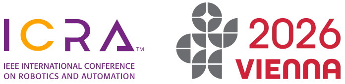
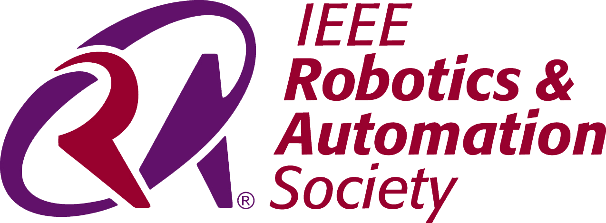
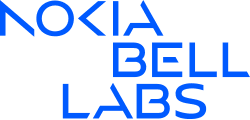
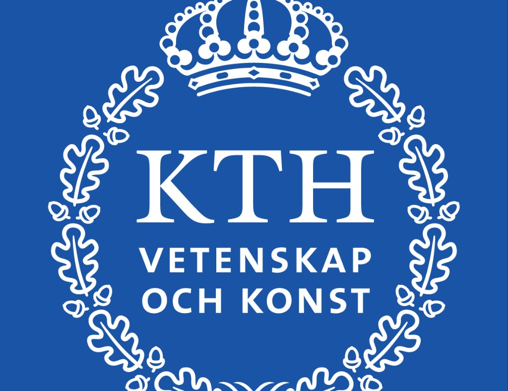
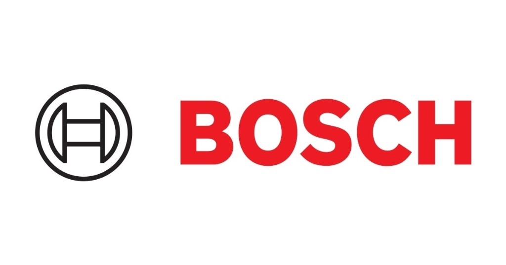
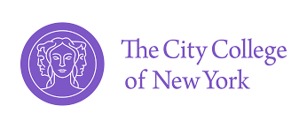

# Connected Autonomous Robotic Systems Workshop

Website repository for the **Connected Autonomous Robotic Systems** workshop initiative and related EARS-CONN activities.

  
  &nbsp;&nbsp;&nbsp;
  
  &nbsp;&nbsp;&nbsp;
  

## Overview

This project maintains the public workshop website and materials around the intersection of:

- robotics and autonomy,
- communication networks,
- edge/cloud intelligence for real-time systems.

The current public site supports the workshop accepted at **IEEE ICRA 2026**.

## Story and Motivation

Dr. **Aliasghar Arab** and Dr. **Mata Khalili** decided to build a recurring workshop series at robotics conferences focused on connected autonomy.

- **First proposal:** submitted to **IROS 2025** (not accepted).
- **Second proposal:** submitted to **ICRA 2026** (accepted).

The ICRA 2026 edition attracted a strong number of paper submissions and featured world-class invited speakers. This validated the need for a dedicated venue that brings together robotics, AI, and communication-network communities.

## What Comes Next

Our goal is to continue this momentum:

- expand and sustain this workshop line across major robotics conferences,
- grow EARS-CONN activities in New York and internationally,
- and bridge toward communication-focused conferences in future editions.

In 2026, **Aliasghar Arab** will host **EARS-CONN at CCNY** as part of this broader vision.

## Website Scope

This repository currently includes:

- main workshop homepage content,
- call-for-papers page and program updates,
- keynote/contributed-paper details,
- organizer and institution assets,
- mobile-responsive website improvements.

## Deployment

Push to the `main` branch for [ears-conn.com](https://ears-conn.com) and push to the `icra` branch for [connected-robots.com](https://connected-robots.com).

## Key People

- **Mata Khalili** (Nokia Bell Labs)
- **Aliasghar Arab** (CCNY / NYU)
- **Shutong Jin** (KTH)
- **Marcus Gualtieri** (Bosch Research)

## Related Institutions

  
  &nbsp;
  
  &nbsp;
  
  &nbsp;
  
  &nbsp;
  

## License

This repository is intended for maintaining workshop web content and related public materials.
