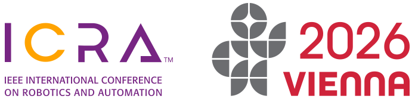
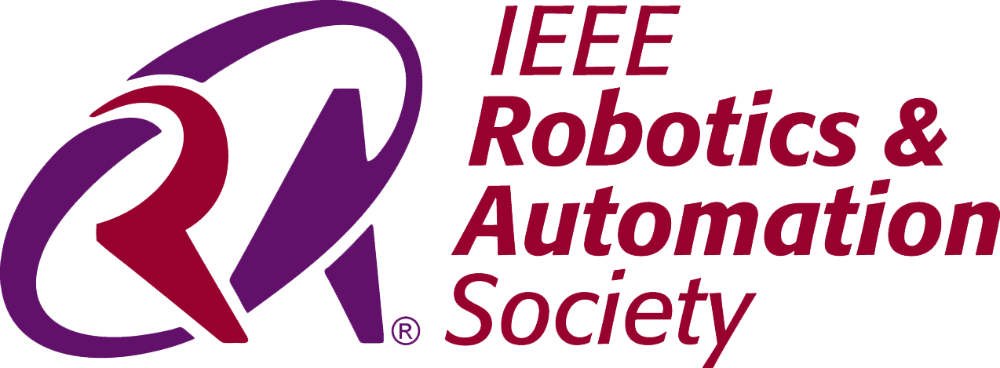
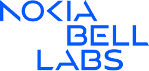
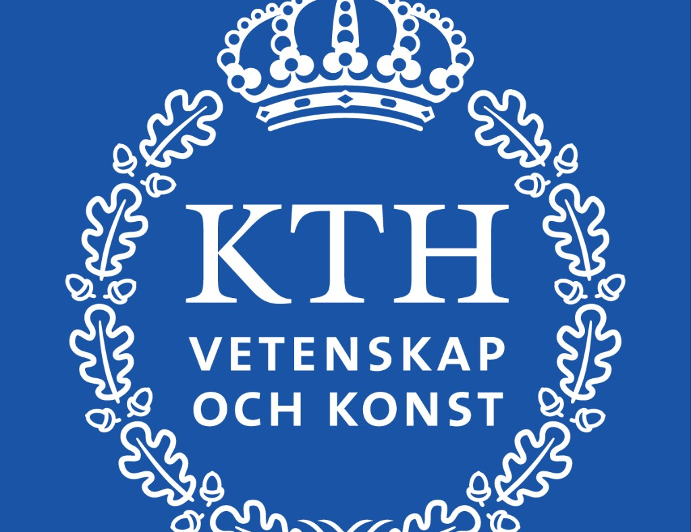
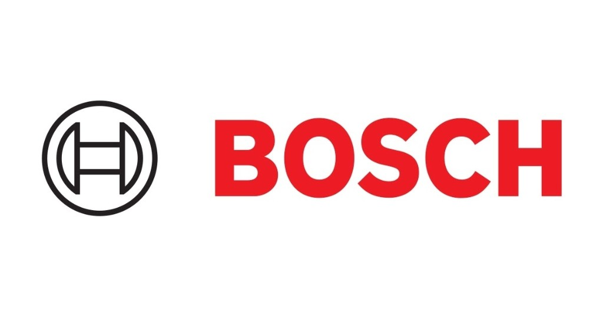
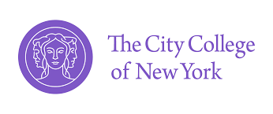

# Connected Autonomous Robotic Systems Workshop

Website repository for the **Connected Autonomous Robotic Systems** workshop initiative and related EARS-CONN activities.

  
  &nbsp;&nbsp;&nbsp;
  
  &nbsp;&nbsp;&nbsp;
  

## Overview

This project maintains the public workshop website and materials around the intersection of:

- robotics and autonomy,
- communication networks,
- edge/cloud intelligence for real-time systems.

The current public site documents the inaugural edition at **IEEE ICRA 2026** in Vienna. The workshop is organized as an annual series at major robotics conferences; future editions will be announced on this site.

## Why Connected Robots

Advances in communication technologies, ranging from WiFi and 5G to satellite and emerging 6G architectures, enable robots to operate not only as standalone units but also as interconnected systems that share information, coordinate actions, and access distributed intelligence, with applications and decision-making increasingly leveraging connectivity to edge and cloud resources. This workshop focuses on how communication networks empower robotic autonomy and how autonomous robotic systems impose new requirements for communication infrastructures.

## Story and Motivation

Dr. **Aliasghar Arab** and Dr. **Mata Khalili** established this workshop as a recurring annual forum at robotics conferences focused on connected autonomy.

- **First proposal:** submitted to **IROS 2025** (not accepted).
- **First edition:** held at **ICRA 2026** in Vienna (inaugural edition).

The ICRA 2026 edition attracted a strong number of paper submissions and featured invited speakers from leading academic and industrial institutions. It validated the need for a dedicated venue that brings together robotics, AI, and communication-network communities.

## What Comes Next

Our goal is to sustain this workshop as an annual series:

- continue editions at major robotics conferences,
- grow EARS-CONN activities in New York and internationally,
- and bridge toward communication-focused conferences in future years.

In 2026, we will host **EARS-CONN at CCNY** as part of this broader vision.

## Website Scope

This repository currently includes:

- main workshop homepage content,
- call-for-papers page and program updates,
- keynote/contributed-paper details,
- organizer and institution assets,
- mobile-responsive website improvements.

## Key People

- **Mata Khalili** (Nokia Bell Labs)
- **Aliasghar Arab** (CCNY / NYU)
- **Shutong Jin** (KTH)
- **Marcus Gualtieri** (Bosch Research)

## Related Institutions

  
  &nbsp;
  
  &nbsp;
  
  &nbsp;
  
  &nbsp;
  

## License

This repository is intended for maintaining workshop web content and related public materials.
